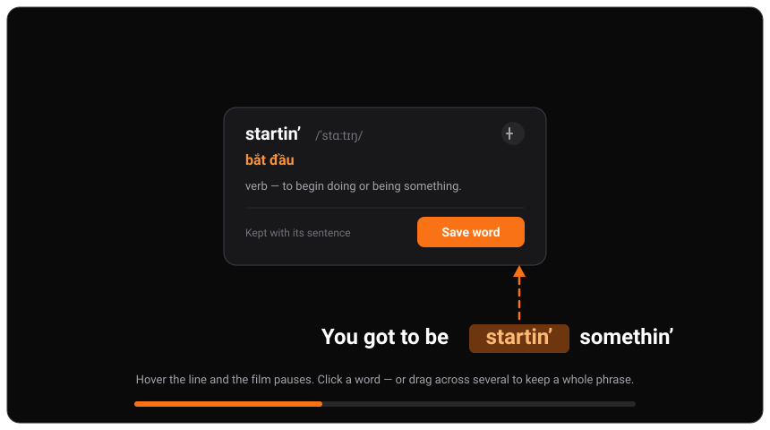
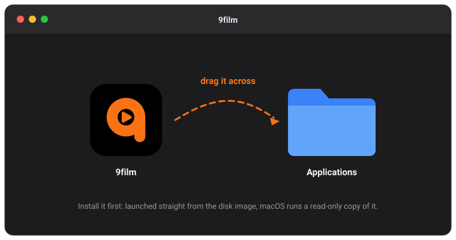
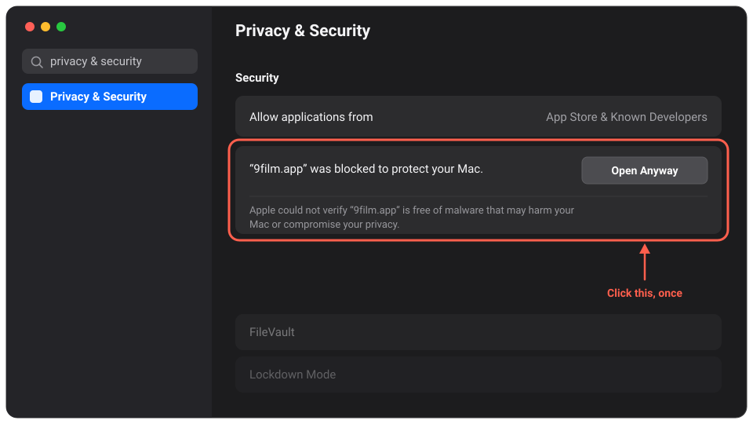
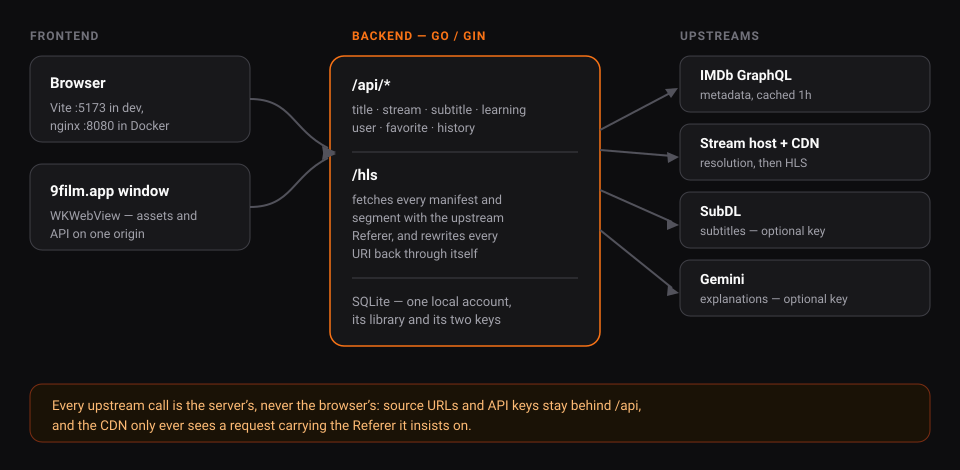

# 9Film

Streams HLS video for any IMDb title and layers an English-learning toolkit on top: vocabulary, AI explanations, self-tests, SM-2 spaced repetition. Single user, no sign-in — one SQLite file on your own machine.



**Frontend** React 19, TypeScript, Vite, Tailwind, Video.js, TanStack Query
**Backend** Go, Gin, SQLite (pure-Go driver, no CGO)

## Download

**[⬇︎ 9film.dmg — macOS, universal](https://github.com/tranquangvu/9film/releases/latest/download/9film.dmg)** · [all releases](https://github.com/tranquangvu/9film/releases)

The server runs inside the window, so there is nothing to start alongside it. macOS 10.15+, Apple Silicon and Intel.

1. Open the `.dmg` and drag **9film** into Applications.

   
2. The first launch is refused — the app is ad-hoc signed, not notarized. Open **System Settings → Privacy & Security**, scroll to **Security**, and click **Open Anyway**. Once, and never again.

   

   Or do it from the terminal instead: `xattr -dr com.apple.quarantine /Applications/9film.app`.
3. The welcome screen asks for two API keys: **SubDL** for subtitles, **Gemini** for idiom breakdowns and AI-graded tests. Both are skippable — what needs them stays off, nothing else changes. They can be set later at Profile → Connections.

No Windows or Linux build: the window chrome and data directory are macOS-specific.

## Run from source

Go 1.25+, Node 20+ with pnpm. Two independent apps, two terminals:

```bash
cd backend && make dev                 # :8081
cd web && pnpm install && pnpm dev     # :5173
```

Vite proxies `/api` and `/hls` to the backend (`API_URL=http://host:port` to point elsewhere). `./9film.db` is created, migrated and seeded on first run. Also: `make build` / `make run` / `make tidy` / `go test ./...`, and `pnpm build` / `pnpm typecheck` / `pnpm lint`.

## Docker

```bash
docker compose up -d --build           # http://localhost:8080
```

nginx serves the built frontend and forwards `/api` and `/hls` to the Go binary — one origin, so there is no CORS to configure. The backend's port is deliberately not published: nothing in the app authenticates, so keep it off the public internet.

Your library — account, favorites, progress, saved words, both keys — lives in the `db` volume and survives everything below except the last line.

```bash
docker compose stop / start / down     # down removes the containers, keeps the volume
docker compose ps                      # state and health
docker compose logs -f api             # backend logs (web for nginx)
docker compose down -v                 # erases the library
docker run --rm -v 9film_db:/d -v "$PWD:/b" alpine cp /d/9film.db /b/9film-backup.db
```

The published port and timezone are literals in `docker-compose.yml`; there is nothing to configure before the first run.

## Desktop build

Needs the [Wails v2 CLI](https://wails.io) and the Xcode command line tools.

```bash
cd desktop
make dev      # live-reloading window (Vite + Go)
make build    # build/bin/9film.app — universal, ad-hoc signed
make dmg      # build/bin/9film.dmg
```

It keeps its own library at `~/Library/Application Support/9film/9film.db`, separate from the `./9film.db` that `make dev` uses.

## Structure



```
backend/   Go API — cmd/api, server/ (public seam for the desktop build),
           internal/{app,config,database,logger,middleware,cache,clients,modules}
web/       React frontend — src/{components,services,hooks,pages,utils}
desktop/   macOS app (Wails v2): both of the above in one window
docker-compose.yml   nginx + the Go binary
```

Each backend module is a vertical slice: `repo.go` → `service.go` → `handler.go` → `route.go`, wired by `module.go`. `CLAUDE.md` has the architecture in depth.
