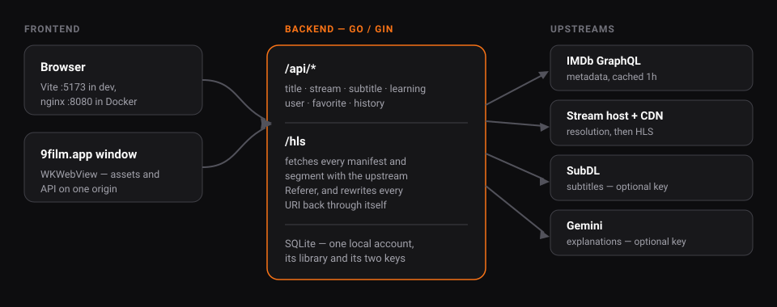

# Architecture



One rule explains most of the design: **the browser never talks to an upstream.** Every source URL, every API key and the `Referer` the CDN insists on stay on the server side of `/api`.

## Backend (`backend/`)

Each feature is a vertical slice under `internal/modules/`:

```
repo.go      data access
service.go   logic
handler.go   HTTP only
route.go     RegisterRoutes
module.go    wires the three together
model.go     DB rows        dto.go   what the frontend sees
```

`Repository` and `Service` are interfaces, so the layer above can be tested against a stub. `stream/` and `subtitle/` are stateless proxies and have neither repo nor model.

Shared infrastructure sits directly under `internal/`: `config/`, `database/`, `logger/`, `middleware/`, `cache/`, and `app/` — the composition root, which opens SQLite, builds the Gin engine and calls each `Module(...)`.

Third-party clients live in `internal/clients/` (`subdl`, `opensubtitles`, `gemini`) and depend on nothing of ours except their sibling `httpx`. Each speaks its vendor's shapes; the translation into app terms is a small adapter in the module that consumes it.

### The two interesting endpoints

- **`/api/stream`** resolves a title id into playable stream URLs, and for a series an episode map. The upstream needs a `Referer`, which the backend scrapes at startup and refreshes every six hours.
- **`/hls`** is the proxy that makes playback work. It fetches each manifest and segment with that `Referer`, and rewrites every URI inside a manifest to point back at itself — so the whole playlist keeps flowing through the backend rather than leaking the CDN to the browser. It is mounted at the engine root, outside `/api`.

### Storage

One SQLite file, created and migrated on startup. It holds the single local account, its library (favorites, watch progress, saved words, tests, reviews) and its two API keys. `Migrate` is schema-only — changing a table means editing the `CREATE` and deleting the file.

## Frontend (`web/`)

```
utils/      pure logic, no fetching
services/   fetch wrappers, mirroring the backend
hooks/      TanStack Query around the services
pages/ components/   render
```

`components/ui/` holds Radix primitives; `components/system/` holds the app's own, grouped by domain (`layout/`, `title/`, `player/`, `learn/`, `common/`). `@/` resolves to `web/src/`.

Playback never receives a raw `.m3u8` — `player/video-player.tsx` always routes it through `/hls`.

## Desktop (`desktop/`)

A Wails v2 module that embeds the built frontend and runs the same Gin engine in-process, so the packaged app starts nothing and opens no browser tab. The engine is reachable two ways: through the webview's asset server (same origin as the app, for `/api` and `/hls`) and over a real loopback listener (for the video element, since macOS hands media to AVFoundation, which cannot resolve the webview's custom scheme).

`CLAUDE.md` documents the constraints around this in full — read it before editing `desktop/`.
